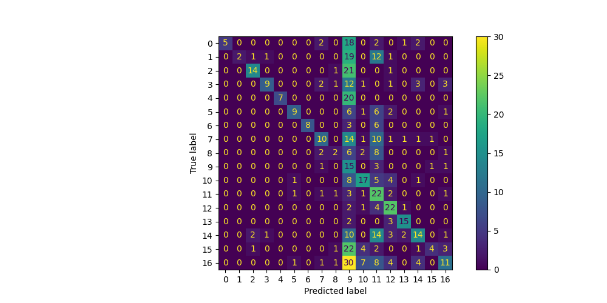

# Labels 
0. End poverty in all its forms everywhere
1. End hunger, achieve food security and improved nutrition and promote sustainable agriculture
2. Ensure healthy lives and promote well-being for all at all ages
3. Ensure inclusive and equitable quality education and promote lifelong learning opportunities for all
4. Achieve gender equality and empower all women and girls
5. Ensure availability and sustainable management of water and sanitation for all
6. Ensure access to affordable, reliable, sustainable and modern energy for all
7. Promote sustained, inclusive and sustainable economic growth, full and productive employment and decent work for all
8. Build resilient infrastructure, promote inclusive and sustainable industrialization and foster innovation
9. Reduce inequality within and among countries
10. Make cities and human settlements inclusive, safe, resilient and sustainable
11. Ensure sustainable consumption and production patterns
12. Take urgent action to combat climate change and its impacts
13. Conserve and sustainably use the oceans, seas and marine resources for sustainable development
14. Protect, restore and promote sustainable use of terrestrial ecosystems, sustainably manage forests, combat desertification, and halt and reverse land degradation and halt biodiversity loss
15. Promote peaceful and inclusive societies for sustainable development, provide access to justice for all and build effective, accountable and inclusive institutions at all levels
16. Strengthen the means of implementation and revitalize the Global Partnership for Sustainable Development
# Experience summary for ZeroShotClassifier
## Confusion matrix

## Metrics
- Accuracy 33.514%
- Precision 63.109%
- Recall 36.753%
